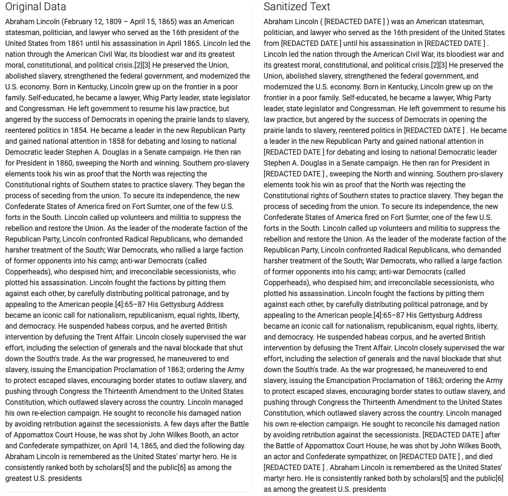
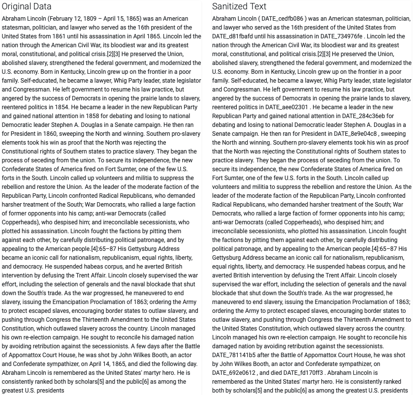

# NLP App for Data Anonymization

The purpose of the `flask` application is to provide a natural langugage processing (NLP) API for different types of `Named Entities`.

This app  builds upon the functionalities of the [Identifier Command Line Script](https://github.com/joewynn/nlp_privacy_data_identifier) for extracting personal identifiable information from text documents. It can be used to achieve the following goals:

    - Pre-processing datasets used for analysis of a population while removing biases due to age, gender, ethnicity etc
    - Protection of customer privacy information while data is on transit or at rest
    - Reduction of sensitive information from text document for business, testing, instructional or analytical purposes

## Analysis

## Use Cases

Here we demonstrate two use cases: 

1. text tokenization
2. text reduction

For this we use text from Wikipedia about [Abraham Lincoln](https://en.wikipedia.org/wiki/Abraham_Lincoln).

### Red**a**ction of _Sensitive_ Information

To redact is to censor or obscure (part of text) for security or legal purposes. The redacted text is not identifeable.

The example below shows, the dates from the article have been redacted.  

 Redacted dates from Abraham Lincorn biography <i>[Source: WikiPedia]</i>

### _Tokenization_ of Text

Tokenization in this context refers to anonymization of sensitive information by using a unique identifier to replacing the desired text. This can allow sharing of important documents with third parties without revealing customers' sensitive information, and then being able to restore the original text after processing.

 Dates in the article have been tokenized to enable recovery <i>[Source: WikiPedia]</i>

## Setting up

### environment

In order to run in the local environment, first we need to install the required dependencies

#### Using `pip` and `conda`
1. Create an environment: `conda create -n <env_name> python=3.6.7`
2. Change to environment: `conda activate <env_name>`
3. Install dependencies: `pip install -r requirements.txt`

### Using `conda`

Simply use:

- `conda env create -f environment.yml`
- `conda activate my_env_name`

### running

After installing dependencies, on the command line run

- `python app.py`

Then point your browser to the address to `http://127.0.0.1:5000/` to play with the app.

## Deploying on a `Pivotal Cloud Foundry`

- `cf push`

